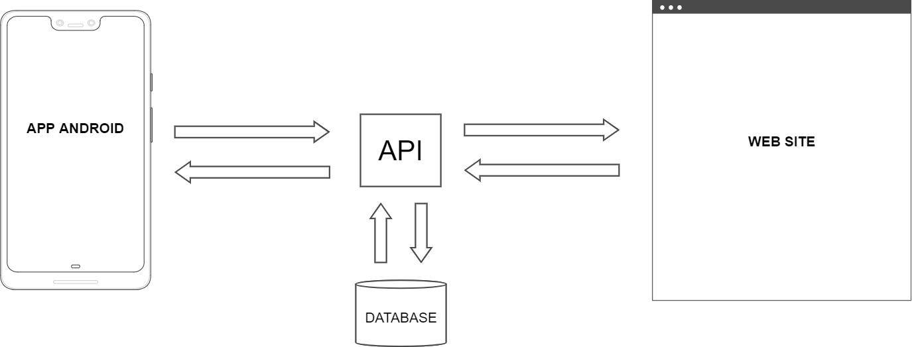

## Projeto de Desenvolvimento em Aplicações Multiplataforma
* **Campus:** Vergueiro
* **Dia:** Sexta-Feira (Pré-aula)
* **Período:** Noite

## Descrição
Nesse semestre teremos um novo desafio na construção do nosso Projeto de Desenvolvimento em Aplicações Multiplataforma. 

Os conceitos desenvolvidos nas demais disciplinas anteriores e deste semestre devem ser empregados em sua completude, ou seja, devem estar presentes em todas as etapas do projeto. O projeto não restringe a utilização de outras tecnologias, mesmo que não tenham sido abordadas no curso.

## Objetivo
Desenvolver um aplicativo em Android que utilize recursos de um site, que também deverá ser desenvolvido, trocando informações via API. Na disciplina de Computação Móvel será fornecida toda a estrutura para o desenvolvimento desta parte do projeto.

## Estrutura do Projeto

Como todo projeto, trabalharemos em grupo e teremos uma série de atividades a serem cumpridas pelos membros do grupo, em datas específicas que serão fornecidas pelo professor. O grupo deverá criar um ambiente no Google Drive e compartilhar o documento disponível acima **Modelo de Projeto** comigo para acompanhamento, realizando as implementações solicitadas para as datas de entrega que estão descritas no **Calendário de Entregas**. Farei as correções de forma online, acessando diretamente o documento no Google Drive. Portanto, não me enviem documentos por e-mail.

Os grupos devem ser formados com cinco (5) alunos e comunicados para mim na próxima aula. Grupos formados anteriormente podem ser mantidos, mesmo que seja maior que cinco (5) o número de alunos participantes. **O projeto pode ser desenvolvido de forma individual. Entretanto, devido a complexidade, pode prejudicar sua avaliação por não cumprir todos os requisitos devido ao tempo**.

## Calendário de Entregas
* **<s>17/04</s>**
	+ Nome e RA dos membros do grupo
	+ Proposta do projeto
	+ Justificativa
	+ Objetivos geral e específicos

* **<s>24/04</s>**
	+ Fundamentação Teórica - Parcial

* **<s>01/05</s>**
	+ Fundamentação Teórica - Completa
	+ Protótipo e Arquitetura do Aplicativo (Android)

* **<s>08/05</s>**
	+ Evolução do Projeto
	
* **15/05**
	+ Entregar protópito de todas as telas
	+ Mostrar a implementação de pelo menos duas Views (Android)

* **22/05**
	+ Mostrar a implementação de todas as telas (Android e Web)

## Professor
Edson Melo de Souza, Me. - ([prof.edson.melo@gmail.com](mailto:prof.edson.melo@gmail.com)) - ([Currículo *Lattes*](http://lattes.cnpq.br/2641658716558510))

## Contato
Em caso de dúvidas encaminhe-me um e-mail, sempre informando seu **RA** e **Nome** no título da mensagem.